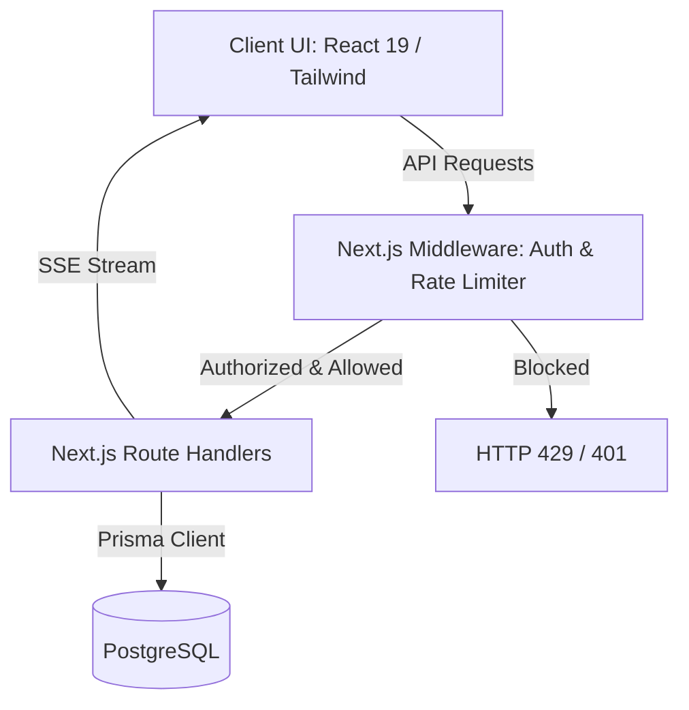

# Arquitetura do Sistema — Paycheck

Este documento detalha os aspectos arquiteturais do **Paycheck**, aplicativo mobile-first de gestão financeira pessoal.

---

## 1. Visão Geral da Arquitetura

O Paycheck é construído com base no framework **Next.js 16 (App Router)** e segue os padrões modernos de desenvolvimento web:

- **Frontend**: Componentes baseados em React 19, renderizados prioritariamente no servidor (Server Components) para carregamento rápido e otimização de SEO, com interatividade controlada via Client Components.
- **Backend (API Routes)**: Roteamento de API nativo no Next.js (App Router), utilizando Route Handlers para expor endpoints REST.
- **Banco de Dados**: PostgreSQL, acessado através do **Prisma ORM 6** como construtor de consultas e gerenciador de migrations.
- **Autenticação**: Gerenciada pelo **Auth.js v5 (NextAuth.js)** baseado em JSON Web Tokens (JWT) com expiração e renovação.
- **Tempo Real**: Implementado via **Server-Sent Events (SSE)** para streaming leve de eventos do servidor para os clientes conectados.

---

## 2. Gerenciamento de Estado

O sistema separa de forma estrita o estado do servidor e o estado local da interface:

### 2.1. Estado do Servidor (Server State)
- Gerenciado utilizando **TanStack Query v5 (React Query)** para requisições no client-side.
- Benefícios: Caching inteligente, invalidação automática de cache, re-fetch em background e otimizações de requisições paralelas.

### 2.2. Estado do Cliente (Client State)
- Gerenciado por **Zustand**.
- Utilizado apenas para interações locais puras que não necessitam persistência direta no servidor, como estado de abertura de modais, filtros temporários ou preferências do tema local.

---

## 3. Estratégia de Comunicação em Tempo Real

Optamos pelo uso de **Server-Sent Events (SSE)** devido às características do projeto:

- **Unidirecionalidade**: O servidor precisa notificar o cliente quando um limite de orçamento for ultrapassado ou quando novas transações agendadas forem consolidadas.
- **Compatibilidade Serverless**: Ao contrário de conexões WebSocket tradicionais que exigem um socket aberto permanentemente (TCP pooling) e um servidor dedicado de conexão direta, o SSE roda sobre HTTP padrão e se integra perfeitamente com Next.js Route Handlers configurados com cabeçalhos de stream.
- **Simplicidade**: SSE utiliza o protocolo HTTP padrão e reconecta automaticamente em caso de queda, sem dependências externas pesadas.

---

## 4. Estratégia de Responsividade (Mobile-First)

Toda a interface é projetada sob o princípio do **Mobile-First**:
- O breakpoint padrão (sem prefixo no CSS) é voltado para telas móveis de 375px de largura.
- Estilos para telas maiores são adicionados progressivamente usando os seletores de breakpoint `md:` (tablets) e `lg:`/`xl:` (desktops e monitores ultra-wide).
- Para componentes estruturais complexos que mudam radicalmente de formato (como formulários em Dialog vs. Sheet), é utilizado o hook de detecção de viewport `useMediaQuery` no lado do cliente.
