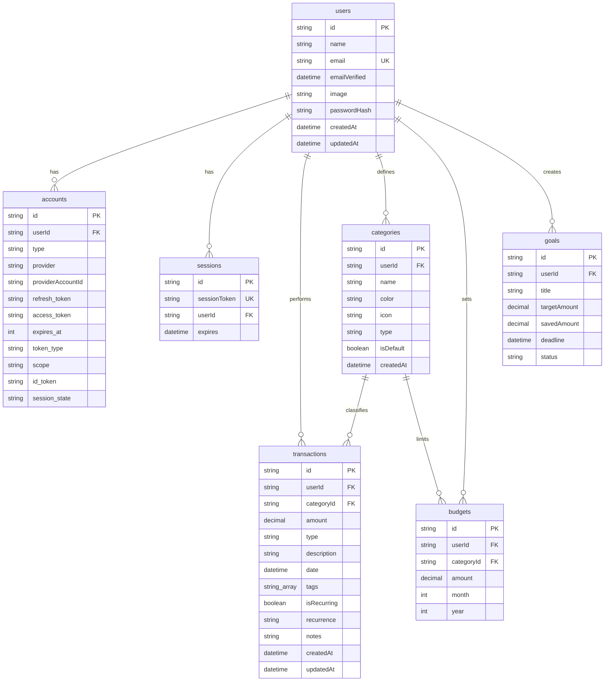

# Modelagem do Banco de Dados — Paycheck

Este documento detalha o modelo relacional do banco de dados do **Paycheck**, utilizando **Prisma ORM 6** e **PostgreSQL**.

---

## 1. Diagrama de Relacionamentos (ERD)

O banco de dados é composto por 7 tabelas principais que suportam a autenticação de usuários, contas externas (OAuth), sessões, transações financeiras, orçamentos e metas de economia.

---

## 2. Tabelas e Campos Relevantes

### 2.1. Usuários e Sessões (Auth.js)
As tabelas `users`, `accounts` e `sessions` são geradas de acordo com as especificações exigidas pelo adaptador do **Auth.js** para garantir conformidade e funcionamento nativo do mecanismo de login e controle de cookies de sessão.

### 2.2. Transações (`transactions`)
- **`amount`**: Representado como `Decimal(12, 2)` no PostgreSQL para evitar problemas comuns de ponto flutuante que ocorrem em campos do tipo `float` ou `double`.
- **`type`**: Enum `TransactionType` com valores `INCOME` (Receitas) ou `EXPENSE` (Despesas).
- **`tags`**: Campo do tipo array de strings `String[]` nativo do PostgreSQL, ideal para classificar transações sem a necessidade de criar uma tabela de junção N:M complexa.
- **`isRecurring` & `recurrence`**: Permite agendamento de transações repetitivas (diário, semanal, mensal ou anual).

### 2.3. Orçamentos (`budgets`)
Define limites mensais de gastos por categoria.
- Possui uma restrição de unicidade composta (`@@unique([userId, categoryId, month, year])`) para impedir que o mesmo usuário crie múltiplos orçamentos para a mesma categoria no mesmo mês/ano.

### 2.4. Metas (`goals`)
Controla o progresso de economia dos usuários.
- **`savedAmount`**: Valor já economizado para a meta (padrão: 0).
- **`status`**: Enum `GoalStatus` que define os estados `ACTIVE`, `COMPLETED`, `PAUSED` ou `CANCELLED`.

---

## 3. Índices e Otimizações de Desempenho

Para assegurar consultas rápidas mesmo com grandes volumes de transações, foram definidos índices compostos na tabela `transactions`:

1. `@@index([userId, date])`: Otimiza a renderização de extratos ordenados por data e filtros temporais.
2. `@@index([userId, type])`: Otimiza a agregação de totais de receitas e despesas no dashboard.
3. `@@index([userId, categoryId])`: Otimiza os relatórios de gastos por categoria e checagem de limites de orçamento.
